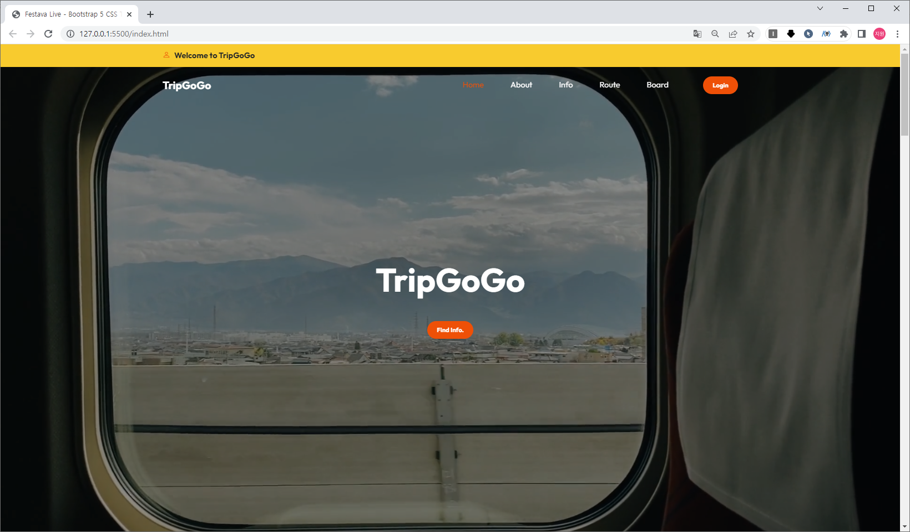
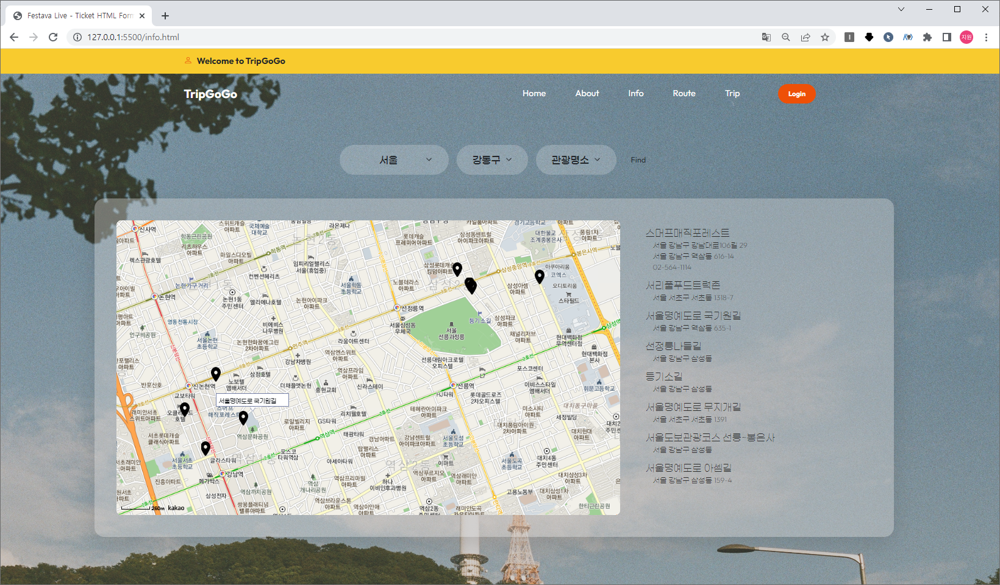
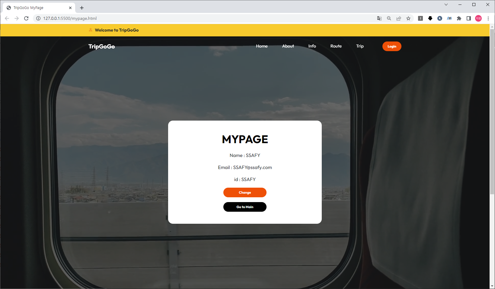
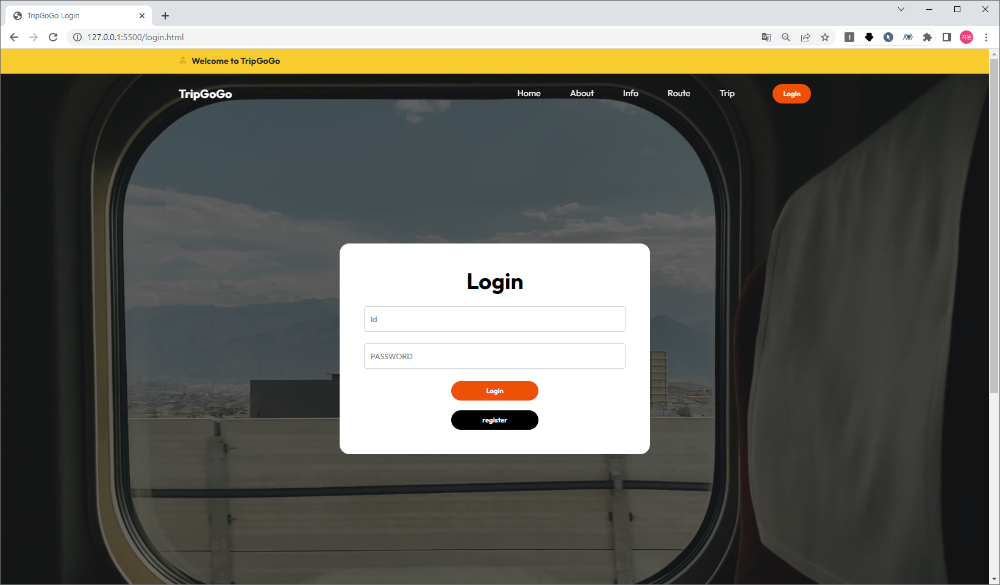
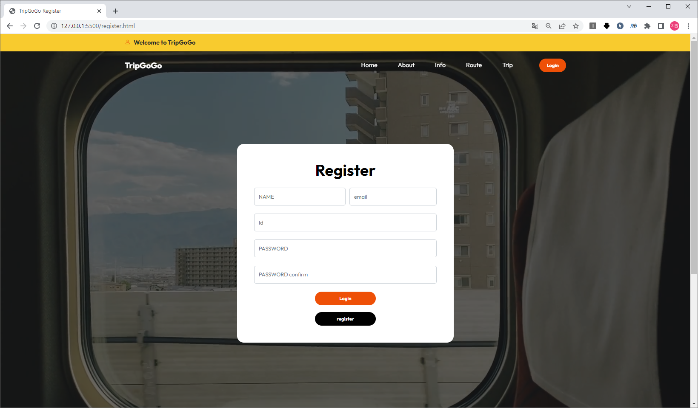
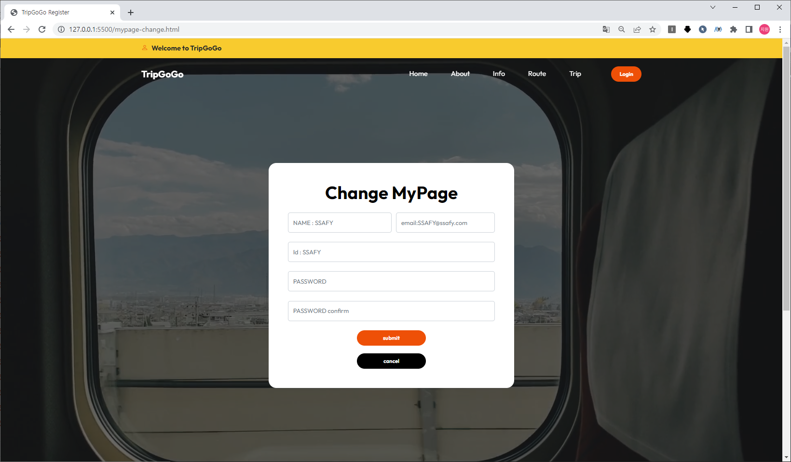
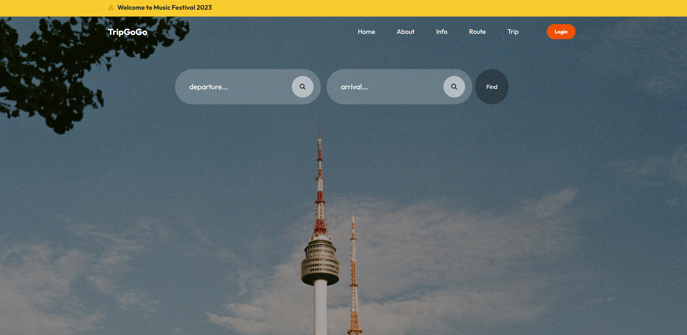
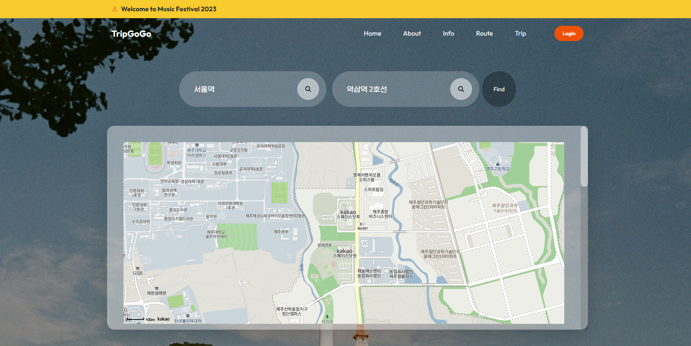
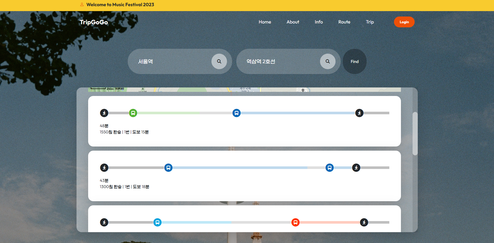

# :airplane: TripGoGo
전국의 음식점, 카페, 관광정보를 한눈에 볼 수 있는 여행 사이트

 

# :bust_in_silhouette: Made by
- 서울 10반 김지은
- 서울 10반 정지원
 

# :clipboard: 주요 기능
<h5> :loudspeaker: 기본 기능</h5>   

1. Main Page  

2. 카테고리 별 관광지 조회(관광지 정보 조회)  

3. 회원 관리 페이지  

4. 로그인 / 로그아웃 페이지    

<h5> :loudspeaker: 추가 기능</h5>  

1. MyTrip(나만의 여행 계획 페이지)  

2. 여행 정보 공유 게시판  

3. 길 찾기  

	
 

# :memo: 웹 페이지
### Main Page
- Main Page

  

### Info - 카페고리 별 관광지 조회
- 관광지, 카페, 음식점 정보 확인 가능

  

### 회원 관리 페이지
- 회원 정보를 확인 할 수 있는 페이지

  

### 로그인 페이지
- 로그인 페이지

  

### 회원가입 페이지
- 회원 가입을 할 수 있는 페이지

  

### 회원 관리 페이지
- 회원 정보를 수정할 수 있는 페이지

  

### Route
- 출발지부터 목적지까지 경로 확인 가능

 

 

 

 

# :mag_right: 사용 데이터
- 한국관광공사_국문 관광정보 서비스_GW [https://www.data.go.kr/iim/api/selectAPIAcountView.do]
- TMAP API [https://tmapapi.sktelecom.com]
- Kakao Map API [https://apis.map.kakao.com]
 

# :computer: 개발언어/프로그램
- HTML / CSS / JavaScript / VS Code
