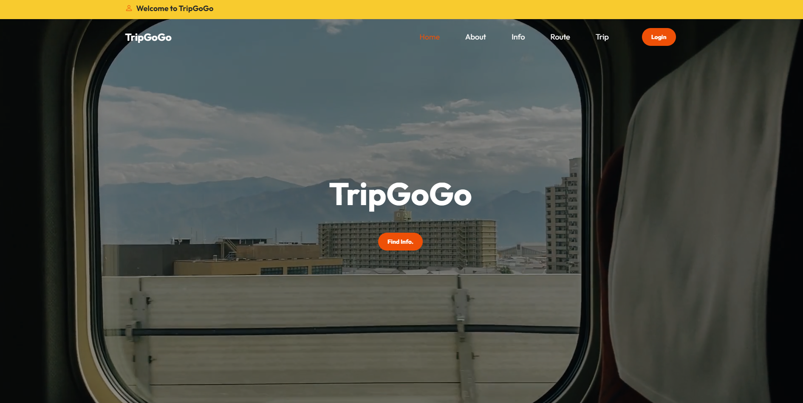
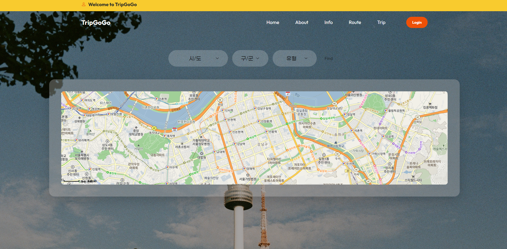

# :airplane: TripGoGo
전국의 음식점, 카페, 관광정보를 한눈에 볼 수 있는 웹사이트

 

# :bust_in_silhouette: Made by
- 서울 10반 김지은
- 서울 10반 정지원
 

# :memo: 웹 페이지
### Main Page
- Main Page

  

### Info
- 관광지, 카페, 음식점 정보 확인 가능

  

### Route
- 출발지부터 목적지까지 경로 확인 가능

 

 

 

 

# :mag_right: 사용 데이터
- 한국관광공사_국문 관광정보 서비스_GW [https://www.data.go.kr/iim/api/selectAPIAcountView.do]
- TMAP API [https://tmapapi.sktelecom.com]
- Kakao Map API [https://apis.map.kakao.com]
 

# :computer: 개발언어/프로그램
- HTML / CSS / JavaScript / VS Code
